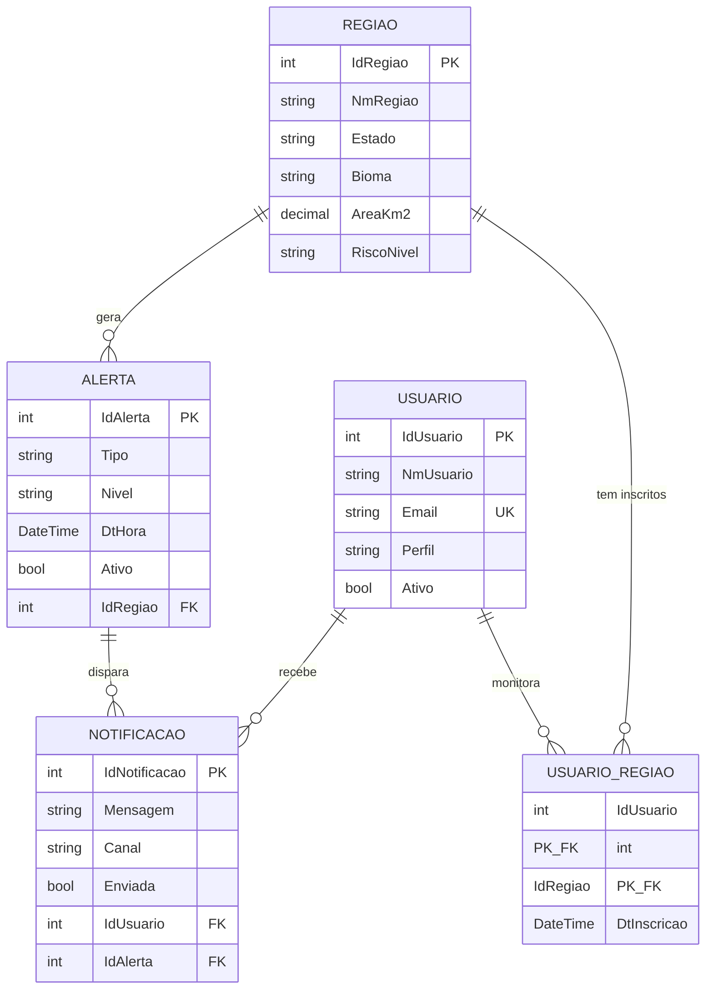

# OrbitalGuard — API .NET

Essa API faz parte do **OrbitalGuard**, um projeto que tenta resolver um problema que o Brasil conhece de cor: a gente sabe que vai ter enchente no Sul, seca no Nordeste, queimada no Cerrado — mas a informação não chega em tempo na mão de quem precisa. O agricultor descobre a tempestade quando a chuva já tá caindo. A defesa civil sabe do deslizamento depois que aconteceu.

A ideia do OrbitalGuard é juntar dados de satélites da NASA/ESA, sensores IoT (ESP32) em campo e regras de negócio na nuvem pra criar um sistema de alerta precoce que avisa **antes**. O projeto é dividido em frentes: uma API principal em Java/Spring Boot que faz a ingestão dos dados orbitais, um banco Oracle que guarda tudo, um app React Native pro celular do agricultor e da defesa civil — e essa aqui em .NET, que é a parte **complementar**, cuidando de **alertas, usuários, inscrições por região e disparo de notificações**.

Resumindo: a Java traz a informação do espaço pra cá, essa .NET decide quem precisa saber.

Esse repositório é a entrega da disciplina **Advanced Business Development with .NET** dentro da Global Solution FIAP 2026/1.

## Links

- Repositório: https://github.com/MurilloFernandesCarapia/OrbitalGuardGS-DotNET
- Vídeo Pitch: https://youtu.be/bCnTYIrPvo8
- Vídeo Do Projeto: https://youtu.be/YoaUg4wpi2E

## Quem fez

O grupo é da turma **2TDSPW** (2º ano de ADS na FIAP). Nessa entrega específica eu fiquei responsável pela API .NET. Integrantes:

- **João Vitor Lacerda** — RM **565565**
- **Murillo Fernandes Carapia** — RM **564969**
- **Kauan Vieira de Lima** — RM **565403**

## O que essa API faz

CRUD completo de cinco entidades — `Regiao`, `Alerta`, `Usuario`, `Notificacao` e a tabela de junção `UsuarioRegiao` que liga usuário a região no relacionamento N:N. Além disso, alguns endpoints que fazem mais que mover dados:

- **Paginação** na listagem de alertas (`?pagina=1&tamanho=10`)
- **Inscrição e cancelamento** de usuário em região — `POST /api/Usuarios/{id}/regioes/{regiaoId}` insere uma linha em `TB_USUARIO_REGIAO`, e o DELETE da mesma rota remove. É o N:N "acontecendo" de forma visível
- **Geração automática de notificações em massa** — chama `POST /api/Notificacoes/gerar/{alertaId}` e a API busca todos os usuários ativos inscritos na região daquele alerta e cria uma notificação pra cada um. É o equivalente em .NET da procedure PL/SQL `sp_gerar_notificacoes` do projeto Oracle do grupo
- **Relatórios agregados** — `/api/Relatorios/resumo` agrupa alertas por região com contagens por nível, `/por-tipo` agrupa por tipo de desastre, `/totais` traz números gerais da plataforma. O EF Core traduz tudo isso em SQL com GROUP BY e subconsultas, sem precisar de stored procedure

## Tecnologias

.NET 10 com ASP.NET Core, Entity Framework Core 10, Oracle 19c (banco da FIAP) via `Oracle.EntityFrameworkCore`, Swagger pela `Swashbuckle.AspNetCore`. Tudo Code-First — as tabelas são geradas a partir das classes C# e versionadas via Migrations.

A connection string aponta pro Oracle da FIAP (`oracle.fiap.com.br:1521/ORCL`) por padrão. Você precisa editar com seu RM e senha antes de rodar.

---

# Como rodar localmente

> ⚠️ A API usa **Code-First com EF Core Migrations** — você não precisa criar tabela manualmente, o próprio EF cria toda a estrutura pra você.

## Pré-requisitos

1. **.NET 10 SDK** — baixe em https://dotnet.microsoft.com/download
2. **Acesso a um banco Oracle 19c+** — Oracle da FIAP ou Oracle XE local

Pra conferir o SDK:

```bash
dotnet --version
```

Tem que aparecer algo tipo `10.0.x`.

## Passo 1 — Clonar e instalar a ferramenta do EF Core

```bash
git clone <url-do-repo>
cd <pasta-do-repo>
dotnet tool install --global dotnet-ef
```

Se já tem o `dotnet-ef`, ele diz "already installed" — segue normal. Pode precisar fechar e reabrir o terminal.

## Passo 2 — Configurar a connection string

Abre `OrbitalGuard.API/appsettings.json` e edita o `OracleConnection`:

```json
{
  "ConnectionStrings": {
    "OracleConnection": "User Id=SEU_RM;Password=SUA_SENHA;Data Source=oracle.fiap.com.br:1521/ORCL;"
  }
}
```

Troca `SEU_RM` e `SUA_SENHA` pelas suas credenciais. Se for usar Oracle XE local, troca o `Data Source` por `localhost:1521/XEPDB1`.

## Passo 3 — Aplicar a migration no banco

```bash
dotnet ef database update --project OrbitalGuard.API
```

Esse comando conecta no Oracle, cria a tabela `__EFMigrationsHistory` e roda a migration `InitialCreate` (que já vem commitada no repo). Resultado: as 5 tabelas — `TB_REGIAO`, `TB_ALERTA`, `TB_USUARIO`, `TB_NOTIFICACAO`, `TB_USUARIO_REGIAO` — ficam prontas com FKs, índices únicos e a chave composta do N:N.

Se der `ORA-00955: name is already used`, é porque o banco já tem alguma tabela com nome conflitante. Apaga elas no SQL Developer, ou roda `dotnet ef database drop --project OrbitalGuard.API` (cuidado: apaga TUDO do schema).

## Passo 4 — Rodar a API

No Visual Studio, F5. Pelo terminal:

```bash
dotnet run --project OrbitalGuard.API
```

Você vai ver no console:

```
Now listening on: https://localhost:7240
Now listening on: http://localhost:5094
```

(As portas podem variar dependendo do seu `launchSettings.json`.)

Abre **`https://localhost:7240/swagger`** no navegador. Da primeira vez vai aparecer aviso de certificado — clica em Avançado → Continuar para localhost. Depois disso, o Swagger abre e dá pra testar tudo.

> **Por que HTTPS e não HTTP?** Porque o `app.UseHttpsRedirection()` redireciona qualquer requisição HTTP pra HTTPS, e o Swagger UI carregado em HTTP não lida bem com esse redirect (mostra erro de CORS). Acessando direto via HTTPS, tudo flui sem redirect.

---

# Como testar no Swagger (roteiro ponta-a-ponta)

Faz isso em ordem que dá pra ver a API funcionando inteira. Os IDs retornados nos POSTs (1, 2, 3...) você vai usando nos próximos passos.

## 1. Criar uma região

`POST /api/Regioes`

```json
{
  "nmRegiao": "Vale do Itajaí",
  "estado": "SC",
  "bioma": "MATA_ATLANTICA",
  "areaKm2": 15500,
  "latitude": -27.0954,
  "longitude": -49.0731,
  "riscoNivel": "ALTO"
}
```

## 2. Criar uma segunda região (pra ter dado pro relatório)

`POST /api/Regioes`

```json
{
  "nmRegiao": "Pantanal Norte",
  "estado": "MT",
  "bioma": "PANTANAL",
  "areaKm2": 95000,
  "latitude": -16.35,
  "longitude": -56.75,
  "riscoNivel": "CRITICO"
}
```

## 3. Criar um usuário

`POST /api/Usuarios`

```json
{
  "nmUsuario": "Carlos Silva",
  "email": "carlos@fazenda.com",
  "senhaHash": "hash_bcrypt_exemplo_123",
  "perfil": "AGRICULTOR",
  "ativo": true
}
```

## 4. Inscrever o Carlos na Vale do Itajaí — o N:N rolando

`POST /api/Usuarios/1/regioes/1` (sem body, só clica Execute)

Esse é o coração do N:N: cria uma linha em `TB_USUARIO_REGIAO` ligando o usuário 1 à região 1.

## 5. Ver as regiões que o Carlos monitora

`GET /api/Usuarios/1/regioes`

Mostra o N:N pelo lado do usuário.

## 6. Criar um alerta crítico em Vale do Itajaí

`POST /api/Alertas`

```json
{
  "tipo": "ENCHENTE",
  "nivel": "CRITICO",
  "descricao": "Volume de chuva acumulado em 24h ultrapassou o limite histórico.",
  "latitude": -27.10,
  "longitude": -49.07,
  "ativo": true,
  "idRegiao": 1
}
```

## 7. Gerar notificações automaticamente pro alerta

`POST /api/Notificacoes/gerar/1?canal=PUSH` (sem body)

A API busca todos os usuários ativos inscritos na região do alerta e cria uma notificação pra cada um. Como o Carlos é o único inscrito, vai criar 1.

## 8. Ver as notificações do Carlos

`GET /api/Notificacoes/usuario/1`

A mensagem é gerada na hora pelo backend, contextualizada com o tipo e nível do alerta.

## 9. Ver o relatório consolidado

`GET /api/Relatorios/resumo`

Devolve um agregado por região: quantos alertas no total, quantos críticos, quantos altos, quantos ainda ativos, e a data do último alerta. É o endpoint que mais "vende" a API.

## 10. Testar entradas inválidas

Esses são os casos que mostram que a API trata erros direito:

- `GET /api/Regioes/999` → **404** "Região não encontrada"
- `POST /api/Alertas` com `"idRegiao": 999` → **400** "A região informada (idRegiao) não existe"
- `POST /api/Usuarios` duas vezes com o mesmo e-mail → **409** "Já existe um usuário cadastrado com este e-mail"
- `POST /api/Usuarios/1/regioes/1` quando já tá inscrito → **409** "Este usuário já está inscrito nesta região"
- `DELETE /api/Regioes/1` quando a região tem alertas → **409** "Não é possível remover esta região porque ela possui alertas vinculados"
- `POST /api/Regioes` sem `nmRegiao` → **400** com a lista de erros do ModelState

---

# Prints da API rodando

Dentro de `docs/screenshots/` deixei alguns prints do Swagger pra dar uma ideia de como fica:

- Um da **tela inicial do Swagger**, com os cinco grupos de endpoints (Alertas, Notificacoes, Regioes, Relatorios, Usuarios) e a barra de título
- Um da **página completa expandida**, com todos os endpoints e a seção **Schemas** no rodapé listando as classes (Alerta, Notificacao, Regiao, ResumoRegiaoDTO, Usuario, UsuarioRegiao, ProblemDetails). Esse print prova que a documentação XML dos `/// <summary>` está sendo lida pelo Swagger
- Um do **`GET /api/Relatorios/resumo`** com o JSON agregado retornado, mostrando as duas regiões com suas contagens. É o relatório-estrela da API

---

# Endpoints

A documentação interativa completa fica no Swagger depois que a API roda. Resumo:

### Regiões — `/api/Regioes`
- `GET /api/Regioes` — lista todas
- `GET /api/Regioes/{id}` — busca por ID
- `GET /api/Regioes/estado/{uf}` — filtra por UF
- `GET /api/Regioes/risco/{nivel}` — filtra por nível de risco
- `POST /api/Regioes` — cria
- `PUT /api/Regioes/{id}` — atualiza
- `DELETE /api/Regioes/{id}` — remove (bloqueia se tiver alertas)

### Alertas — `/api/Alertas`
- `GET /api/Alertas?pagina=1&tamanho=10` — lista paginada
- `GET /api/Alertas/{id}` — busca por ID
- `GET /api/Alertas/regiao/{regiaoId}` — alertas de uma região
- `GET /api/Alertas/nivel/{nivel}` — filtra por nível
- `GET /api/Alertas/ativos` — só os ativos
- `POST /api/Alertas` — cria (valida FK)
- `PUT /api/Alertas/{id}` — atualiza
- `DELETE /api/Alertas/{id}` — remove (bloqueia se tiver notificações)

### Usuários — `/api/Usuarios`
- `GET /api/Usuarios` — lista todos
- `GET /api/Usuarios/{id}` — busca por ID
- `GET /api/Usuarios/perfil/{perfil}` — filtra por perfil
- `POST /api/Usuarios` — cria (e-mail único)
- `PUT /api/Usuarios/{id}` — atualiza
- `DELETE /api/Usuarios/{id}` — remove (cascade nas notificações e inscrições)
- `GET /api/Usuarios/{id}/regioes` — regiões que o usuário monitora ⭐
- `POST /api/Usuarios/{id}/regioes/{regiaoId}` — inscrever em região ⭐
- `DELETE /api/Usuarios/{id}/regioes/{regiaoId}` — cancelar inscrição ⭐

### Notificações — `/api/Notificacoes`
- `GET /api/Notificacoes` — lista todas
- `GET /api/Notificacoes/{id}` — busca por ID
- `GET /api/Notificacoes/usuario/{usuarioId}` — notificações de um usuário
- `GET /api/Notificacoes/alerta/{alertaId}` — notificações de um alerta
- `POST /api/Notificacoes` — cria avulsa
- `PUT /api/Notificacoes/{id}` — atualiza (ex: marcar enviada)
- `DELETE /api/Notificacoes/{id}` — remove
- `POST /api/Notificacoes/gerar/{alertaId}?canal=PUSH` — gera em massa pros inscritos ⭐

### Relatórios — `/api/Relatorios`
- `GET /api/Relatorios/resumo` — alertas agregados por região ⭐
- `GET /api/Relatorios/por-tipo` — alertas agrupados por tipo
- `GET /api/Relatorios/totais` — totais da plataforma

---

# Como os dados se ligam



Em ASCII pra quem prefere:

```
TB_REGIAO (1) ──────┬──→ TB_ALERTA (N) ─────→ TB_NOTIFICACAO (N) ←── TB_USUARIO (1)
                    │                                                       │
                    └──→ TB_USUARIO_REGIAO (N) ←────────────────────────────┘
                              (junção N:N)
```

As regras de integridade que ficam **explícitas no banco** (configuradas via Fluent API no `AppDbContext`):

- **Não dá pra apagar uma região que tem alertas** — `Restrict` na FK `Alerta → Regiao` (preserva o histórico)
- **Apagar um usuário leva junto** suas notificações e suas inscrições em regiões — `Cascade`
- **Não dá pra apagar um alerta que já gerou notificações** — `Restrict` (preserva trilha de auditoria)
- **E-mail de usuário é único** — índice único em `TB_USUARIO.EMAIL`
- **Nome de região é único por UF** — índice composto em `TB_REGIAO(NM_REGIAO, ESTADO)`

A história coerente é: **dado de histórico/auditoria é protegido (Restrict), dado de associação é limpo automaticamente (Cascade)**.

---

# Estrutura do código

```
OrbitalGuard/
├── OrbitalGuard.API/
│   ├── Controllers/         ← 5 controllers (Alertas, Notificacoes, Regioes, Relatorios, Usuarios)
│   ├── Models/              ← Regiao, Alerta, Usuario, Notificacao, UsuarioRegiao
│   ├── DTOs/                ← ResumoRegiaoDTO (projeção do relatório)
│   ├── Data/
│   │   └── AppDbContext.cs  ← Fluent API: índices, chave composta, FK behavior
│   ├── Migrations/          ← InitialCreate (commitada)
│   ├── Properties/launchSettings.json
│   ├── Program.cs           ← pipeline ASP.NET + EF + Swagger
│   ├── appsettings.json     ← connection string Oracle
│   └── OrbitalGuard.API.csproj
├── docs/
│   └── screenshots/         ← prints do Swagger
├── .gitignore
├── OrbitalGuard.API.slnx
└── README.md
```

---

# Por que algumas decisões

Algumas escolhas que merecem ser justificadas (e que provavelmente caem nas perguntas da apresentação):

**Code-First com Migrations, não Database-First.** A verdade do modelo vive nas classes C#, e cada mudança no schema vira uma migration versionada no Git. Pra adicionar uma nova funcionalidade, é só alterar o Model, rodar `dotnet ef migrations add NomeDaMudanca`, e o EF gera o diff (CREATE/ALTER) automaticamente. Em produção a mesma migration roda em qualquer ambiente, e se algo der ruim o método `Down()` reverte.

**Sem camada de Repository.** O `AppDbContext` já é, na prática, um Unit-of-Work + Repository genérico (`DbSet<T>`). Adicionar outra abstração ia gerar boilerplate sem ganho real pra um projeto desse porte. Controller → DbContext é direto, legível e fácil de manter.

**Sem DTOs pra entrada.** Validação fica nas DataAnnotations dos Models (`[Required]`, `[MaxLength]`, `[EmailAddress]`, `[Range]`) e o ASP.NET valida via `ModelState.IsValid` automaticamente. A única exceção é o `ResumoRegiaoDTO` no endpoint do relatório, que precisa ser uma classe nomeada pra o Swagger gerar Schema decente da projeção agregada.

**Junção N:N explícita (`UsuarioRegiao`), não skip-navigation implícito do EF.** Ter a classe `UsuarioRegiao` deixa a tabela `TB_USUARIO_REGIAO` visível no banco (importante pra defender na apresentação) e ainda permite adicionar metadados na inscrição, tipo a `DtInscricao` — que serve pra saber desde quando o usuário acompanha aquela região.

**Mix de `Restrict` e `Cascade` nas FKs.** Dado de histórico é protegido (Restrict), dado de associação some junto (Cascade). Conta uma história coerente sobre integridade — sem isso, ou você perde histórico por engano, ou fica com lixo órfão no banco.

**`ReferenceHandler.IgnoreCycles`** no JSON serializer pra evitar o loop infinito clássico (Regiao → Alertas → Regiao → ...).

**Tratamento de `DbUpdateException`** nos DELETEs e nos POSTs que dependem de constraints únicas. A FK ou o índice único do Oracle já bloquearia, mas a mensagem nativa do erro é hostil — a gente captura e traduz pra `409 Conflict` com texto em português que faz sentido pro frontend.

---

# Problemas que podem aparecer

**`dotnet-ef` não é reconhecido**
> Você não instalou o tool global. Roda `dotnet tool install --global dotnet-ef` e fecha/reabre o terminal.

**`ORA-12541: TNS:no listener` ou `ORA-12170: TNS:Connect timeout`**
> Sem acesso ao Oracle. Confere se a VPN da FIAP tá ligada (se for o caso), ou se o `Data Source` do `appsettings.json` está correto.

**`ORA-01017: invalid username/password`**
> Usuário ou senha errado no `appsettings.json`.

**`ORA-00955: name is already used by an existing object`**
> O schema já tem tabela conflitante. Apaga ela no SQL Developer ou roda `dotnet ef database drop --project OrbitalGuard.API` (cuidado: limpa TUDO).

**Swagger abre mas todos os endpoints retornam "Failed to fetch" com mensagem de CORS / Network Failure**
> Você abriu o Swagger em HTTP e o `UseHttpsRedirection` está redirecionando pra HTTPS — o navegador trata isso como origem diferente e bloqueia o fetch. Solução: abre **`https://localhost:7240/swagger`** direto (ajusta a porta HTTPS pra o número que o terminal mostra ao subir a API). Da primeira vez aceita o aviso de certificado.

**Swagger volta vazio mesmo após criar dados**
> Provavelmente cadastrou na primeira execução e depois rodou `database drop` ou perdeu o schema. Os dados moram no Oracle — se o banco foi resetado, perdeu mesmo. Cadastra de novo seguindo o roteiro.

---

# Sobre o projeto

O OrbitalGuard é parte da **Global Solution FIAP 2026/1** — desafio _Espaço, a Nova Fronteira / A Economia Espacial_. Usa dados de satélites NASA/ESA, sensores IoT em campo e regras de negócio na nuvem pra gerar alertas precoces de desastres climáticos no Brasil — protegendo agricultores, comunidades vulneráveis e equipes de defesa civil.

Esse repositório especificamente é a entrega da disciplina **Advanced Business Development with .NET**.

**Não é production-ready** — não tem autenticação JWT, não tem rate limiting, não tem cache distribuído, não tem CI/CD. O foco aqui é demonstrar domínio dos conceitos da matéria: Web API com Controllers, EF Core Code-First com Migrations, Oracle, REST, OpenAPI, DataAnnotations, relacionamentos 1:N e N:N. Tudo isso a gente cumpriu.

Alinhamento com ODS da ONU atendidos pelo OrbitalGuard como um todo: **ODS 2** (Fome Zero), **ODS 8** (Trabalho Decente), **ODS 9** (Inovação e Infraestrutura), **ODS 11** (Cidades Sustentáveis) e **ODS 13** (Ação Climática).

Se você é o professor avaliando: bem-vindo, espero ter feito direito 😄

---

OrbitalGuard Team · 2TDSPW · FIAP · Junho de 2026
