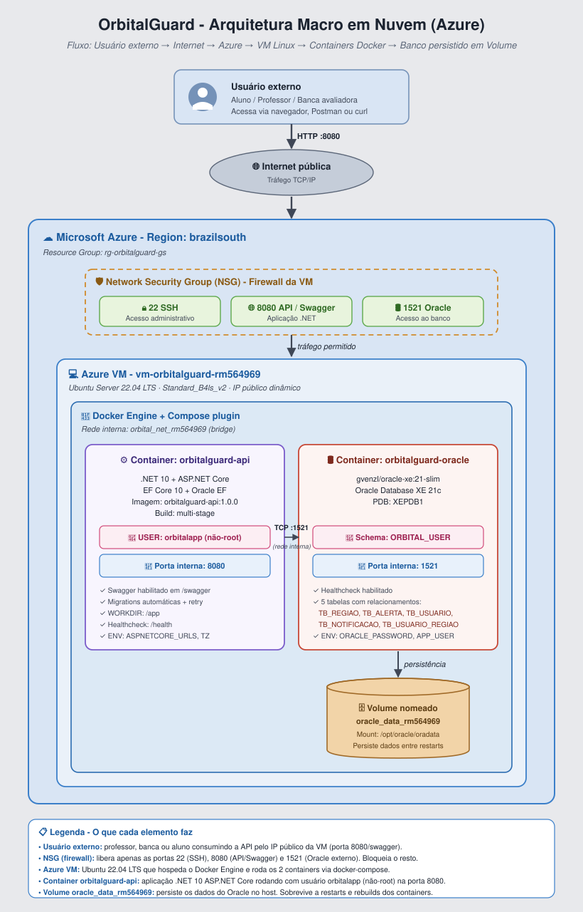

# OrbitalGuard — Entrega DevOps Tools & Cloud Computing

Esse repositório é a entrega da **Global Solution** da disciplina **DevOps Tools & Cloud Computing**, FIAP 2026/1, turma **2TDSPW**. O que ele faz: pega a API .NET que a gente construiu na disciplina de *Advanced Business Development with .NET* — o **OrbitalGuard** — empacota tudo em containers Docker, sobe em uma VM Linux na Azure, e deixa a aplicação rodando de verdade na nuvem, acessível pela banca, com o banco Oracle persistido em volume nomeado.

A API já existia. O que essa entrega de DevOps adiciona é toda a camada de infraestrutura: Dockerfile multi-stage com usuário não-root, Docker Compose orquestrando a API com um Oracle XE 21c em outro container, volume nomeado pra não perder dados quando o container reinicia, rede privada do Docker entre os dois containers, e tudo rodando em uma VM Linux na Azure com acesso externo pelo IP público.

## Quem fez

A entrega é da turma **2TDSPW** (2º ano de Análise e Desenvolvimento de Sistemas):

- **João Vitor Lacerda** — RM **565565**
- **Murillo Fernandes Carapia** — RM **564969** 
- **Kauan Vieira de Lima** — RM **565403**

Como o requisito do trabalho pede o RM do representante nos nomes dos containers, **564969** aparece em todos os artefatos relevantes:

- Container do App: `app-orbitalguard-rm564969`
- Container do Banco: `oracle-orbitalguard-rm564969`
- Volume nomeado: `oracle_data_rm564969`
- Rede Docker: `orbital_net_rm564969`

## Sobre o que o OrbitalGuard resolve

O OrbitalGuard tenta atacar um problema bem brasileiro: a gente sabe que vai ter enchente no Sul, seca no Nordeste, queimada no Cerrado — mas a informação não chega em tempo na mão de quem precisa. O agricultor descobre a tempestade quando a chuva já tá caindo. A defesa civil sabe do deslizamento depois que aconteceu.

A ideia é juntar dados de satélite (NASA/ESA), sensores IoT em campo e regras de negócio na nuvem pra disparar alertas precoces — antes do evento crítico chegar. O projeto na Global Solution é dividido em frentes: uma API principal em Java/Spring Boot que faz a ingestão dos dados orbitais, um banco Oracle, um app React Native pro celular do agricultor e da defesa civil, e essa API .NET aqui, que é a parte complementar — cuida especificamente de **alertas, usuários, inscrições por região e disparo de notificações**.

Em uma frase: a Java traz a informação do espaço pra cá; essa .NET decide quem precisa saber.

## Arquitetura macro



O desenho mostra o caminho completo:

1. **Desenvolvimento** — código no GitHub, build local com `dotnet`, e nesta entrega o deploy é feito direto dentro da VM (a equipe puxa o repositório, sobe os containers e valida tudo lá dentro)
2. **Azure** — um Resource Group com VNet, Subnet, NSG (com as portas 22 / 8080 / 1521 liberadas) e uma VM Ubuntu 24.04 rodando o Docker Engine. Dentro do Docker Engine sobe a rede `orbital_net_rm564969` (bridge), os dois containers, e o volume nomeado `oracle_data_rm564969`
3. **Cliente / Banca** — acesso externo via Swagger UI no navegador (`http://IP_PUBLICO:8080`), ou via curl/Postman pra bater nos endpoints REST

Importante: o desenho é uma **arquitetura macro de nuvem**, com componentes reais, redes, portas e volumes — não é fluxograma, não é TOGAF. A rubrica da GS zera a questão se o diagrama for em TOGAF ou parecer um fluxograma.

## Stack técnico

- **Aplicação**: .NET 10 + ASP.NET Core, Entity Framework Core 10, `Oracle.EntityFrameworkCore`, Swashbuckle/Swagger
- **Banco**: Oracle Database 21c Express Edition (imagem pública `gvenzl/oracle-xe:21-slim`)
- **DevOps**: Docker + Docker Compose v2, GitHub
- **Nuvem**: Microsoft Azure — Resource Group, VNet, Subnet, NSG, VM Linux Ubuntu 24.04 LTS, tamanho Standard D2s v3 (2 vCPU, 8 GB RAM)

## O que a API faz

CRUD completo sobre cinco tabelas com relacionamentos reais:

| Tabela | Conteúdo | Relacionamentos |
|---|---|---|
| `TB_REGIAO` | Regiões monitoradas (ex: Vale do Itajaí/SC, Pantanal Norte/MT) | 1:N com Alerta, N:N com Usuário (via UsuarioRegiao) |
| `TB_ALERTA` | Alertas climáticos (enchente, seca, queimada, tempestade, deslizamento) | N:1 com Região, 1:N com Notificação |
| `TB_USUARIO` | Usuários (agricultor, defesa civil, pesquisador, admin) | 1:N com Notificação, N:N com Região |
| `TB_NOTIFICACAO` | Notificações enviadas aos usuários a partir de um alerta | N:1 com Usuário, N:1 com Alerta |
| `TB_USUARIO_REGIAO` | Tabela de junção do N:N entre Usuário e Região | Chave composta (id_usuario, id_regiao) |

São cinco tabelas com FKs e relacionamento real, incluindo um N:N materializado em uma tabela de junção. O requisito da GS pede no mínimo duas tabelas com relacionamento — aqui são cinco.

Tudo isso é criado **automaticamente pelo EF Core Migrations** na primeira vez que a API sobe — não precisa rodar `dotnet ef database update` à mão.

Além do CRUD básico, a API expõe:

- `POST /api/Usuarios/{idUsuario}/regioes/{regiaoId}` — inscreve um usuário em uma região (cria linha em TB_USUARIO_REGIAO, materializa o N:N)
- `POST /api/Notificacoes/gerar/{alertaId}` — gera notificações em massa pra todos os usuários inscritos na região do alerta
- `GET /api/Relatorios/resumo` — agrega alertas por região com contagens por nível
- `GET /api/Relatorios/por-tipo` — agrupa por tipo de desastre
- `GET /api/Relatorios/totais` — números gerais da plataforma

## Como rodar localmente (Docker Desktop)

Primeiro, você precisa de **Docker Desktop** instalado e rodando. Se ainda não tem, baixa em https://www.docker.com/products/docker-desktop.

### 1) Clona o repositório

```bash
git clone https://github.com/MurilloFernandesCarapia/OrbitalGuardGS-DevOps.git
cd OrbitalGuardGS-DevOps
```

### 2) Sobe os dois containers em background

```bash
docker compose up -d --build
```

A primeira vez demora uns 5 a 10 minutos porque o Docker precisa baixar:

- A imagem do Oracle XE 21c (~1 GB)
- A imagem do SDK do .NET 10 (~700 MB, só pro build)
- A imagem do runtime do ASP.NET 10 (~200 MB, vai pra imagem final)

E ainda precisa esperar o Oracle ficar `healthy` (uns 90 segundos).

### 3) Confere se está tudo de pé

```bash
docker compose ps
```

Esperado:

```
NAME                              STATUS                  PORTS
app-orbitalguard-rm564969         Up X minutes            0.0.0.0:8080->8080/tcp
oracle-orbitalguard-rm564969      Up X minutes (healthy)  0.0.0.0:1521->1521/tcp
```

### 4) Abre o Swagger

No navegador:

```
http://localhost:8080
```

Vai aparecer toda a documentação dos endpoints. Pode testar o CRUD direto por aí.

### 5) Pra ver as tabelas no banco

```bash
docker exec -it oracle-orbitalguard-rm564969 sqlplus orbital_user/OrbitalPwd123@//localhost:1521/XEPDB1
```

Já entra no SQL*Plus conectado como o usuário aplicacional. Dá pra rodar:

```sql
SELECT table_name FROM user_tables ORDER BY table_name;
SELECT * FROM tb_regiao;
EXIT
```

### 6) Pra derrubar tudo

```bash
docker compose down       # para os containers, mantém o volume
docker compose down -v    # para e apaga o volume (banco zerado)
```

## Como foi feito o deploy na Azure

A VM foi criada pelo **portal Azure** (poderia ser via Azure CLI também, mas o portal é mais visual e atende igual). Configuração da VM:

- **Nome**: OrbitalGuard
- **Imagem**: Ubuntu Server 24.04 LTS
- **Tamanho**: Standard D2s v3 (2 vCPU, 8 GB RAM)
- **Região**: South Africa North
- **Auth**: SSH key gerada pelo próprio portal
- **NSG**: três regras inbound — porta 22 (SSH, padrão), 8080 (API), 1521 (Oracle)
- **IP público**: configurado no momento da criação (no nosso caso `102.133.163.36`)

Depois disso, o caminho na VM foi:

1. SSH na VM:
   ```bash
   ssh azureuser@102.133.163.36
   ```
2. Instalação do Docker Engine, Docker Compose plugin e git:
   ```bash
   sudo apt-get update -y
   sudo apt-get install -y ca-certificates curl gnupg git nano
   curl -fsSL https://get.docker.com | sudo sh
   sudo usermod -aG docker $USER
   sudo apt-get install -y docker-compose-plugin
   ```
   Aí faz logout e login pro grupo `docker` valer.
3. Clone do próprio repositório:
   ```bash
   git clone https://github.com/MurilloFernandesCarapia/OrbitalGuardGS-DevOps.git
   cd OrbitalGuardGS-DevOps
   ```
4. Sobe os containers:
   ```bash
   docker compose up -d --build
   ```

A partir daí a API fica acessível em `http://102.133.163.36:8080` — não é localhost, está realmente em nuvem.

## Decisões técnicas e bugs encontrados no caminho

Algumas decisões e ajustes que vale documentar pra quem vier depois entender o porquê:

**1) Por que não usar `APP_USER` da imagem `gvenzl/oracle-xe`?**

A imagem oferece uma forma "fácil" de criar um usuário aplicacional via variáveis de ambiente (`APP_USER` e `APP_USER_PASSWORD`). Tentamos usar no começo e o usuário não era criado direito — a API recebia `ORA-01017: invalid username/password` mesmo com a senha correta. Trocamos por um script `01-init.sh` em `/container-entrypoint-initdb.d/` que cria o `orbital_user` manualmente via `sqlplus` com heredoc. Funcionou de primeira.

**2) Por que removemos `ORACLE_DATABASE: XEPDB1` do docker-compose?**

Essa variável serve pra criar um **PDB adicional** no Oracle, não pra "dizer qual usar". Como o `XEPDB1` já vem criado por padrão na imagem do Oracle XE 21c, tentar criar de novo dava `ORA-65012: Pluggable database XEPDB1 already exists`, e esse erro abortava o resto do setup. Tirando a variável, a imagem usa o XEPDB1 que já existe e o nosso `01-init.sh` consegue rodar normalmente.

**3) Por que o `Program.cs` aplica Migrations no startup?**

Em um deploy normal, você roda `dotnet ef database update` antes de subir a API. Em container isso não cola — não dá pra entrar no container, rodar comando, e depois iniciar a API. Resolvemos colocando um bloco no `Program.cs` que faz `db.Database.Migrate()` no startup, com loop de retry de até 30 tentativas com 10 segundos entre elas. Assim o container da API sobe, vê o Oracle ainda iniciando, espera, e quando o banco fica disponível ele aplica as Migrations e segue.

**4) Por que desligamos o `UseHttpsRedirection` em Production?**

Em container a gente não tem certificado HTTPS configurado (e nem deveria — TLS termina antes, em um proxy reverso na produção real). Se o `UseHttpsRedirection` ficar ligado, qualquer `curl http://...` é redirecionado pra `https://` e quebra. Em Development a gente mantém ligado (porque o `dotnet run` local faz isso); em Production, fica desligado.

## Evidências da entrega (pra revisão da banca)

Pra demonstrar que tudo o que a rubrica pede está coberto:

### Os dois containers em background

```bash
docker compose ps
```

### Logs do App e do Banco

```bash
docker logs app-orbitalguard-rm564969 --tail 30
docker logs oracle-orbitalguard-rm564969 --tail 30
```

### `docker exec` no App mostrando estrutura + usuário não-root

```bash
docker exec app-orbitalguard-rm564969 sh -c 'pwd; ls -l; whoami; id'
```

Esperado: `pwd = /app`, `whoami = orbitalapp`, `id = uid=1001(orbitalapp)`.

### `docker exec` no Banco mostrando estrutura + usuário

```bash
docker exec oracle-orbitalguard-rm564969 bash -c 'pwd; ls -l; whoami; id'
```

### Volume nomeado e rede

```bash
docker volume ls | grep orbital
docker volume inspect oracle_data_rm564969
docker network inspect orbital_net_rm564969
```

### Evidência de persistência com SELECT no banco

```bash
docker exec -it oracle-orbitalguard-rm564969 sqlplus orbital_user/OrbitalPwd123@//localhost:1521/XEPDB1
```

```sql
SELECT table_name FROM user_tables ORDER BY table_name;
SELECT id_regiao, nm_regiao, estado, risco_nivel FROM tb_regiao;
SELECT id_alerta, tipo, nivel, ativo, id_regiao FROM tb_alerta;
SELECT id_usuario, nm_usuario, email, perfil FROM tb_usuario;
SELECT id_notificacao, mensagem, canal, enviada FROM tb_notificacao;
SELECT id_usuario, id_regiao, dt_inscricao FROM tb_usuario_regiao;
EXIT
```

### Acesso externo (não é localhost)

Do navegador da banca ou de qualquer máquina:

```
http://102.133.163.36:8080
```

Carrega o Swagger UI e responde nos endpoints CRUD.

## Estrutura do repositório

```
.
├── Dockerfile                       Imagem multi-stage do App .NET 10
├── docker-compose.yml               Orquestra App + Oracle com rede + volume
├── .dockerignore                    Reduz contexto do build
├── .env.example                     Variáveis de ambiente (copie pra .env se quiser customizar)
├── .gitignore
├── README.md                        Esse arquivo
├── DEPLOY_NOTES.md                  Anotações do deploy real na Azure VM
├── ROTEIRO_VIDEO.md                 Roteiro do vídeo de entrega da GS
├── docs/
│   ├── arquitetura-macro.svg        Arquitetura macro de nuvem (vetorial)
│   └── arquitetura-macro.drawio     Mesma arquitetura, editável no draw.io
├── sql/
│   └── 01-init.sh                   Cria o usuário orbital_user no Oracle no startup
└── OrbitalGuard.API/                Código-fonte da API .NET
    ├── Controllers/                 5 controllers (Alertas, Notificacoes, Regioes, Relatorios, Usuarios)
    ├── Models/                      5 entidades (Regiao, Alerta, Usuario, Notificacao, UsuarioRegiao)
    ├── Data/AppDbContext.cs         DbContext com mapeamento e FKs
    ├── DTOs/                        DTOs para os relatórios
    ├── Migrations/                  Migration "InitialCreate" cria todas as tabelas
    ├── Program.cs                   Startup + Migrations automáticas + Swagger
    ├── appsettings.json
    └── OrbitalGuard.API.csproj
```

## Links importantes

- **GitHub desta entrega (DevOps)**: https://github.com/MurilloFernandesCarapia/OrbitalGuardGS-DevOps
- **GitHub do projeto .NET original**: https://github.com/MurilloFernandesCarapia/OrbitalGuardGS-DotNET
- **Vídeo da entrega no YouTube**: 
- **Demo em nuvem** (enquanto a VM estiver no ar): http://102.133.163.36:8080

---

Esta entrega segue o roteiro de containerização da disciplina de DevOps Tools & Cloud Computing da FIAP, turma 2TDSPW, 2026/1.